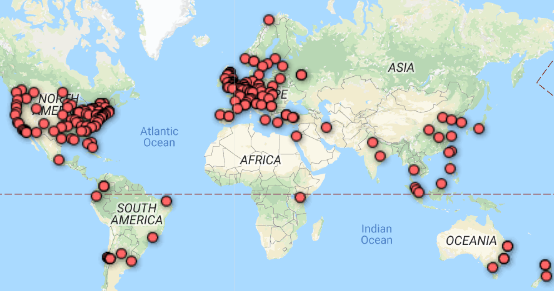

## Everything is awesome. Everything is cool when you’re part of a team.
 
The idea of having heaps of scientists come together to accomplish something none of them could do on their own is not new. Take [CERN](https://home.cern/), established in 1954 and one of the most famous large scale collaborations in science to date. CERN is a massive experimental undertaking with a mission to address fundamental problems in physics. Today, it employs over 2500 scientists from 22 countries and has lead to some pretty impressive innovations, like the construction of the Large Hadron Collider (the world's biggest machine), the discovery of the Higgs boson, and the invention of the Word Wide Web. 

The utility of large scale collaborations in psychology is much the same as in physics. Sometimes, the costs of doing good science outgrows the resources available to the individual researcher. In physics, this might be the money and manpower required to build machinery necessary for empirical observation. For example, the Large Hadron Collider experiments has an expected price-tag of around 5.5 billion USD [@2018b]. In psychology, large scale collaboration has the potential to help us muster the organizational resources required to collect sufficiently large and diverse (non-WEIRD) samples from the human population. It can also can mitigate subpar research practices caused by individual knowledge gaps by bringing together multiple researchers with a wide variety of skills and expertise. 

Large scale collaborations are already beginning to impact psychology in important ways. For example, a summary of the 100 replication studies included in the “Reproducibility Project: Psychology” was published in Science [@OpenScienceCollaboration2015], and the project has helped elevate the status of replication research in psychology ever since. The idea of reproducibility projects has also spread to neighbouring areas, and similar collaborative undertakings can now be found in experimental economics [@Camerer2016], cancer biology [@zotero-1577], experimental philosophy [@Cova2018], and social science research published in Science and Nature [@Camerer2018]. Other established collaborations include the “Many Labs” projects, which have published authoritative reports on the role of contextual effects in psychological research, including the infamous end-of-semester effect [@Ebersole2016]. The “Many Babies” project [@zotero-1543] is studying thousands of infants in an attempt to address some big questions in developmental psychology. To illustrate how do these collaborations function and how they help us do good science, let me describe the one I am a member of in a little more detail. 

In August 2017, Dr. Christopher R. Chartier published a [blog post](https://christopherchartier.com/2017/08/26/building-a-cern-for-psychological-science/) outlining a new kind of collaboration project within psychology. Inspired by the structure of CERN, this would be a standing network of volunteer labs from all across the world that would work together on huge and distributed data collection efforts, with a democratic and decentralized system of governance. Just 27 days later, the [Psychological Science Accelerator](https://psysciacc.org/) (PSA) was born. Today, over 300 psychology labs from more than 50 countries have voluntarily signed up as members of the network, and several operations and advisory committees are hard at work hammering out our guidelines and operational procedures. We have three research projects in the pipeline so far, and continually send out calls for new project proposals. You do not have to be a member to propose a project to the network, and once projects are accepted, labs from the network volunteer for data collection on each individual project. 

The purpose of the PSA is to provide the manpower necessary to conduct high-quality studies of important research questions in psychology. We aim to address several of the key issues facing psychological research all at once. Every project conducted by the PSA network will be pre-registered, and simultaneously replicated by multiple labs. Projects will be guaranteed a sample size large enough to provide accurate estimates of the effects of interest. Because the network contains labs from all continents, we also have the ability to facilitate culturally diverse sampling by default. In addition to increased and culturally diverse samples, we are bringing together hundreds of scientists with a diverse set of skills, backgrounds and knowledge. Because we can draw on such an immense pool of expertise, we are uniquely able to secure the quality of study designs. we can also distribute tasks that would normally be extremely time-consuming, like the translation of materials into several different languages. The first study the PSA took on, which will test the valence-dominance model of social perception, now has 117 labs from around the world committed to data collection. Study materials are being translated into 22 separate languages, and committees are assisting the lead authors with everything from ethics applications to statistical analysis. Replication. WEIRD samples. Precision. Expertise. The goal is to address them all in one coordinated effort. 

It is hard to accurately describe just how impactful the data from these collaboration projects may turn out to be for psychology. The “Reproducibility Project: Psychology” has ignited discussions of reproducibility throughout and beyond the realm of psychology. The Many Labs projects have done much to nuance these discussions and to enhance our understanding of how psychological effects behave across experiments. Both projects have stimulated a host of innovations in our methods and research practices. In addition, it is usually standard practice for large scale collaborations to make their data freely accessible online. This adds value in at least two ways. First, it respects the principle of transparency in science, and makes it possible for independent researchers to verify any reported results [which can be extremely important. See e.g. @Etchells2018]. Second, it allows independent researchers to reuse the data in novel ways. For example, data from Many Labs 3 have been reanalyzed to provide falsifying tests of ego depletion theory [@Vadillo2018]. 

The collaborations here mentioned are all fairly recent projects, so we can only speculate what their long term impact on the field will be. However, my hunch is that we are witnessing the early version of what will become a new gold standard for research in psychology. By no means do I think that large scale collaboration projects will be the only research conducted in psychology. These projects are slow moving, inflexible, and resource intensive compared to small scale lab research, and sometimes studies needs to be cheap and flexible. But I do think that large scale collaboration projects will become the most rigorous empirical process we can subject many of our research questions to. As such, I also think the data from these projects will eventually constitute much of the foundation upon which novel psychological theory will build. I therefore heartily recommend checking out the research that is coming out of these projects. They are authoritative reports on the topics they cover, and they have taught me a lot about psychological science in general. 

If you are passionate about psychological research, why not join a collaboration yourself? The Psychological Science Accelerator welcomes members from all walks of academia. Contribution is voluntary, and level of contribution is completely up to you. At our website you can find a link to [our sign-up form](https://psysciacc.org/get-involved/). We need help with everything from reviewing incoming project proposals, to feedback on policy, to data collection. I'm unfortunately not sure how other projects handle lab recruitment at the time of writing. If you do, let me know in the comment section! 

I suppose the deeper reason why I see large scale collaboration as a solution to current issues is that I believe science is a fundamentally collaborative effort. If you share your discovery, we all make the discovery. If you share your knowledge, we all become knowledgeable. Ambition, prestige and a competitive spirit may drive individual scientists to do great things, but there would be no moon landing, no human genome project, no penicillin, no internet, if not for the ability of all scientists to work together in a common pursuit of knowledge. 

## Acknowledgements
This is a shortened, translated version of an article to be published in "Psykologisk tidsskrift NTNU", a pscyhology magazine run by students at the Norwegian University of Science and Technology. Thanks to Gerit Phul for providing feedback on the english version of the manuscript.  

# References