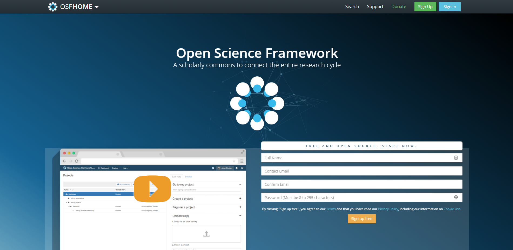
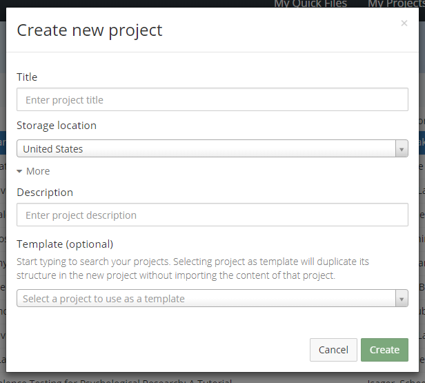
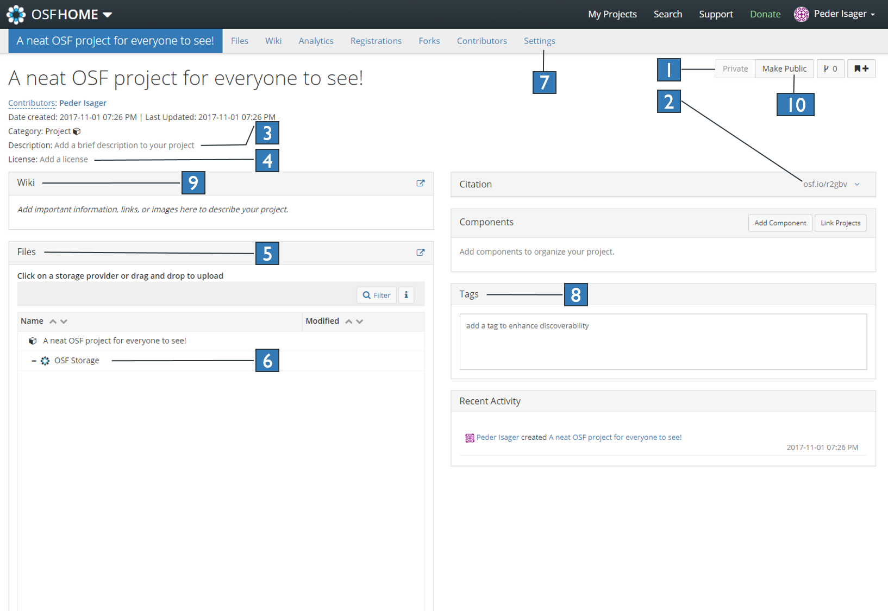

#### **Disclaimer:** 
*In the time I spent writing up this blog post, [Courtney Soderberg](https://twitter.com/cksoderberg) published [a tutorial manuscript for data sharing on OSF](https://doi.org/10.1177%2F2515245918757689) in the journal AMPPS. I highly recommend checking it out!*

#### Intro

The Open Science movement is here to stay. Journals, reviewers, and fellow scientists increasingly expect that data and materials from research findings be made available upon publication. There are very good reasons for this, as open data and materials have the potential to increase reproducibility and collaboration, reduce the cost of data collection, and shift the focus from single findings to cumulative research programs. I think every researcher will stand to benefit from these uptakes in open practices. However, it is one thing to preach open science, and antother to practice it. 

If you have never made data available online before, it might all seem a bit daunting. Where should I put the data? What should I put up? What do I need to consider before I do it? Fortunately, making data available online does not need to be be very difficult. There are a few things you should know before posting your data online, but if you learn how to do it once, the procedure is overall quite similar from dataset to dataset. The time investement is well worth it in my experience. Katherine Wood has already written [an excellent blog post](https://katherinemwood.github.io/post/data_sharing_tips/) with general tips and advice on sharing data and analysis scripts. So exellent in fact, that you should just read it, and come back afterwards. See you soon! 

...

Welcome back! Now that you know what you should think about when making your data and analysis scripts open, let me walk you through a practical example of how you can do this on The Open Science Frameword (OSF). This is just one of many platforms for data sharing you could consider, but OSF's flexibility and general user friendliness makes it a good place to start.

OSF is a website maintained by the Center for Open Science, and is a hub for everything Open Science. OSF will store your data *for free*, and they have a back-up fund in case they run out of money, guaranteeing that your data will be accessible for at least 50 years. In other words, you get a free back-up of your data, and you can die happy, knowing that your data will live on long after you are gone. On that cheerful note, let's get started! 

#### Create a profile

First, you need to head over to OSF and create a profile. As mentioned, this is completely free. On the front page, click the green "Sign up" button, fill in your personal details, and you should be good to go.

When you are signed up and logged in, you should find yourself on the OSF dashboard. OSF keeps data and materials sorted into "projects", and on the home screen you get an overview of your projects. In the upper right corner you will find a taskbar. If you click your name and then click "My Profile" in the drop-down menu, you can see and add information about yourself such as social media accounts, your ORCID ID, etc. To get back to the dashboard from anywhere, click the "OSF **HOME**" button on the upper left of the page. Now let's create a project and see how we can add data to it. 

#### Create a new project

When on the dashboard page, click the green "Create new project" button. This will open a dialogue box prompting you to fill in the name of the project. Try to write a sensible name that describes the content of the project (I.e. not "Data"). A good solution is to use the title of the paper/manuscript/grant proposal that is connected to the data you want to share. You will also be prompted to choose at which location you would prefer your data to be stored. If you are an EU researcher, choose "Germany - frankfurt" as your storage location to make your data [GDPR](https://www.insight.mrc.ac.uk/2018/04/16/gdpr-research-changes/) compliant. Check out [this link](http://help.osf.io/m/settings/l/952786-set-a-global-storage-location) to learn how to change the default storage location for all your future projects. You can also click "more" below the title box, and add a description (you can edit this later as well). When done, click "create", and click "Go to new project" in the following dialogue box.

Welcome to your new project! You should now be looking at your brand new project page! On this page you can add all the files and information relevant to your project/study. Notice immediately that your project is currently private (fig 3.1). This means that only you have access to this project and its contents. You can add collaborators in privat mode (like a shared folder on Dropbox), but the project and its content will not be *publicly* available until you decide to make it so. If all you want is a way of sharing data with collaborators, you can even choose to *never* make the project public. If you do make it public, also note the citation box (fig 3.2). You, or anyone visiting your project, can click the arrow in the far right corner of the box and get a dropdown box of citations in different style formats. In addition to this, public projects can also get a DOI (Once you make a project public, a "Create DOI/ARKID" link appears about 5 lines below the project name). This makes it easy for you to cite your project in a manuscript or CV, and for others to cite your project in their publications. 

#### Set up and navigate the project page

Now let's give people a reason to cite this project! Here is a step by step by step guide for setting up your project in a way that makes it easy for people to find and use the information you want to share. 

1. Add a description of your project (fig 3.3). If you have already written a manuscript on the data, you could just click this field and paste the abstract. In any case, the description should make it clear what the project is intended for, and what kind of information one can expect to find here. 

1. Add a license for your project (fig 3.4).  Having a liberal license for your data is more important than you may think. If you share materials without a license, people are not strictly allowed to reuse it (without risking legal prosecution from you). You can find more information about licensing your data [here](https://wiki.creativecommons.org/wiki/Data). If you just want to get on with it however, click "add a license", and in the "**Choose a license:**" drop-down menu, choose either the [CC0 1.0 Universal](https://creativecommons.org/publicdomain/zero/1.0/) or the [CC By Attribution 4.0 International](https://creativecommons.org/licenses/by/4.0/). They are both aimed at making your data open and reducable by others with minimal legal restrictions. If you want to know more about why licensing is important, or you want to know the difference between the CC licenses, [Chris Hartgerink](https://twitter.com/chartgerink) has written [a short, informative, and accessible article on Medium](https://medium.com/read-write-participate/copyright-and-licenses-in-open-access-publishing-da73e0ca8ed3) about it. 

1. Before uploading, make sure that people can understand and work with the materials you upload. This implies the following:
    a. Name the variables in your dataset sensibly, and perhaps add a document that defines and describes each variable (a [codebook](http://www.ddialliance.org/training/getting-started-new-content/create-a-codebook)). In addition, adding extra materials, such as experiment presentation files, design descriptions, etc., can be a crucial supplement to the methods section of your paper for someone who really wants to understand how the experiment was conducted.
    a. Provide a complete recipe script for any published analyses in case someone wants to doublecheck your reporting. In SPSS, this is made in a syntax (.sps) file. In R, this is made in an R script (.R) file. The script should start by importing/loading the raw (anonymized) data, then include every manipulation imposed on the data (like deletions, renamings, and exclusions), and end with the functions for generating the plots running the statistical tests that you report. In other words, a person who downloads your data and analysis files should just have to press play in the appropriate software to reproduce the numbers in your paper. If you can't add raw data for ethical reasons, add a dataset as close to the raw as possible. Why? Imagine you made a mistake in renaming a variable, or someone disagrees with your exclusion critera. If someone then wants to change the way the data is manipulated, they will need access to the pre-manipulation version of the dataset.
    a. Make sure that accessing your data is free, or as cheap as possible. If you use SPSS for data analysis, something you might never think about is the fact that all the files you save in .sav, .spv, and .sps format requires SPSS to open them. So anyone who wants to reuse your data will need SPSS as well, and that baby costs \$99 per month! Same goes for matlab (\$580-\$2300 per license), e-prime (\$995 per license) and other common commercial research software. A [.csv](https://www.computerhope.com/issues/ch001357.htm) version of your dataset can be read and created by basically any program, so [create one](https://www.computerhope.com/issues/ch001356.htm) and add it just in case.
1. Upload your data and materials! This is as simple as dragging and dropping the files into the "Files" box (fig 3.5). You can also click on "OSF Storage" (fig 3.6) and click on the "upload" button that appears above. If you want to import data directly from services like Dropbox, Google Drive, or GitHub, you will find a list of add-ons you can integrate by going to Settings (fig 3.7). 
1. Add some relevant tags (fig 3.8) to make your project easy to find on Google and OSF search.
1. If you want to add some information about the project, consider putting it into the project Wiki (fig 3.9). Detailed info on how to edit the wiki can be found [here](http://help.osf.io/m/collaborating/l/524109-using-the-wiki).
1. Let the public in! If you are happy with the content, settings, and information included in your project (and you want to make it public), press the "Make Public" button (fig 3.10). Read through the warnings that pops up and, if you are sure that your project meets ethical requirements for open data sharing, click "Confirm". 

#### Finding help and more information

Did you run into any trouble along the way? Fear not! Reliable sources tell me that OSF also has a very real and friendly human person you can reach at support@osf.io, who would be happy to help you out. 

No more trouble? Then congratulations! You now have an open, licensed, reuasable, and citable version of your data and materials that can be accessed by anyone for the forseeable future. Just put a link to the project in your manuscript and voilà! Anyone can make use of your openly shared data, at no extra cost to you! 
\newline
\newline

*PS: If you want to see an example of any of the recommendations offered here, check out [the OSF project for this post](https://osf.io/r2gbv/) where I tried to address them all. You can also find a lot more information and help on the [OSF support pages](https://osf.io/support/)*.

*PPSS: If you are interested in learning more about how to increase the transparency of your research practices, check out this [detailed practical guide to transparency in psychological science](http://doi.org/10.1525/collabra.158), by Klein et al.* 

