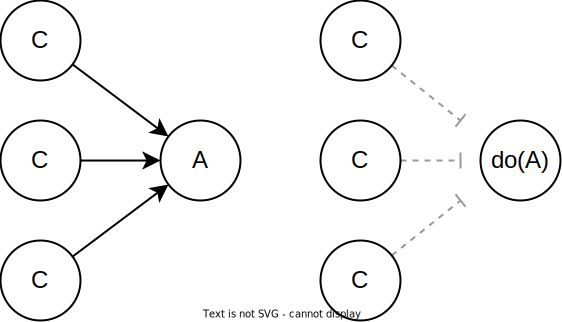

```{r setup, include=FALSE}
knitr::opts_chunk$set(echo = TRUE)
options(scipen=1, digits=2)
set.seed(20241308)
```

# Introduction

In this blog post I will describe eight basic rules that govern the relationship between causal mechanisms in the real world and associations/correlations we can observe in data. To make each rule as easy as possible to understand, I will describe each rule both in words and in causal graph and logic terms, and I will offer some very simple simulation R code for each rule to demonstrate how it works in practice. 

These eight rules represent basic building blocks of causal inference. Most causal analysis procedures involve one or more of these rules to some extent. If you are completely new to formal causal inference, learning these rules can serve as a springboard to learn more complicated things. If you apply causal inference regularly in your own research then you might find this post useful as a cheat sheet. For a much more detailed introduction to causal inference, see @Hernan2020, and the [Causal Diagrams course](https://www.edx.org/learn/data-analysis/harvard-university-causal-diagrams-draw-your-assumptions-before-your-conclusions?index=product&queryID=a52aac6e59e1576c59cb528002b59be0&position=1&linked_from=autocomplete&c=autocomplete) from HarvardX.

# Four fundamental causal structures

A causal graph is a depiction of a causal mechanism between variables. In the graph, variables (nodes) are drawn as circles ⚪ (or sometimes as squares), and the causal relationships  (paths) between these variables are drawn as arrows → that point from the thing causing (causal ancestor) to the thing being caused (causal descendant). 

Any causal graph, no matter how complicated, can be broken down into four elemental building blocks. The blocks are defined by the type of path that can be traced between the variables. All the rules that I will describe below deal with one or more of these building blocks, so it is useful to start by stating and describing them. By recognizing which blocks we are working with in any given instance we will know which causal inference rules are relevant.

## 1. Complete independence.

No path can be traced between A and B. 
  
  
  
## 2. Chain

In causal chains, a directed path can be traced from A to B, such that all arrows point from A to B. Chain paths are sometimes called an “open path”, which means that this type of graph transmits correlation between A and B (see rule 2). When a chain involves three or more variables, the variables M linking A and B are often called mediators. 
  
 
  

  
## 3. Fork

In a causal fork, an undirected path (not all arrows run in the same direction) can be traced from A to B through a common causal ancestor C. C is often called a confounder variable. Fork paths are “open” and transmit correlation between A and B (see rule 3).
  
 
  
## 4. Collider

In a causal collider, an undirected path (not all arrows run in the same direction) can be traced from A to B through a causal descendant D. D is often called a collider variable. Collider paths are “closed” and do not transmit correlation between A and B (see rule 1).
  
  
 
# Basic rules for causal inference

## Rule 1: Independent variables are not correlated

If A and B are causally independent, they will be unassociated in data. 

*If {width=20%} then A ⫫ B.*

```{r, fig.dim = c(5, 5)}
# Rule 1
n=10000  # Number of data points
a <- rnorm(n, 0, 1)  # A is a random variable
b <- rnorm(n, 0, 1)  # B is a random variable
plot(a, b)  
cor(a, b)  # Correlation between A and B
```

A and B are causally independent even if they share a causal descendant (causal collider), D. Two independent causes of a shared descendant are not correlated with each other (unless rule 7). 


## Rule 2: Causal influence creates correlation

If A is a cause of B, or if B is a cause of A, then A and B will be correlated in data.

*If {width=20%} or {width=20%} then A ~ B.* 

```{r, fig.dim = c(5, 5)}
# Rule 2
n=10000  # Number of data points
a <- rnorm(n, 0, 1)  # A is a random variable
b <- a + rnorm(n, 0, 1)  # B is a function of A
plot(a, b)  
cor(a, b)  # Correlation between A and B
```

This also applies if A causes M, and M in turn causes B (mediation). 

*If {width=30%} then A ~ B.* 

```{r, fig.dim = c(5, 5)}
# Rule 2 (mediation)
n=10000  # Number of data points
a <- rnorm(n, 0, 1)  # A is a random variable
m <- a + rnorm(n, 0, 1)  # M is a function of A
b <- m + rnorm(n, 0, 1)  # B is a function of M
plot(a, b)  
cor(a, b)  # Correlation between A and B
```

## Rule 3: Confounding creates correlation

If A and B share a common ancestor C (causal fork), A and B will be correlated in data. This phenomenon is often called confounding, or the “third variable problem”. 

*If {width=30%} then A ~ B.*

```{r, fig.dim = c(5, 5)}
# Rule 3
n=10000  # Number of data points
c <- rnorm(n, 0, 1)  # C is a random variable
a <- c + rnorm(n, 0, 1)  # A is a function of C
b <- c + rnorm(n, 0, 1)  # B is a function of C
plot(a, b)  
cor(a, b)  # Correlation between A and B
```

The rule also applies if the effects of C on A and/or B are mediated through other variables. 


## Rule 4: Random manipulation protects a variable from causal influence

When we are able to randomly allocate the values of A - such as in a randomized controlled experiment where A is the manipulation variable - no other variable can influence A.



The notation *do(A)* refers to randomizing the values of A. Put differently, with complete experimental control and randomization we make sure that no variable is allowed to influence the values of A.

# Adjustment rules

To *adjust for* a variable X means to look at relationships in data that contain only a subset or single value of X. It can also mean to look at relationships for all the values of X separately. Adjustment goes by a number of different names in the sciences, including “control for”, “condition on”, “hold constant”, “stratify”, “select”, etc. 

In the figures below, a square box around a variable node indicates that this variable is being controlled/adjusted for.

## Rule 5: Controlling for a confounder blocks correlation arising from that confounder

If A and B share a common ancestor C (causal fork), the confounding correlation between A and B that is created by C (rule 3) is removed if C is controlled for. 

*If {width=30%} then A ⫫ B.* 

```{r, fig.dim = c(5, 5)}
# Rule 5
n=10000  # Number of data points
c <- rnorm(n, 0, 1)  # C is a random variable
a <- c + rnorm(n, 0, 1)  # A is a function of C
b <- c + rnorm(n, 0, 1)  # B is a function of C
x <- lm(b~c)
y <- lm(a~c)
plot(x$residuals, y$residuals) 
cor(x$residuals, y$residuals)  # Correlation between A and B, controlling for C
```

## Rule 6: Controlling for a mediator blocks correlation arising from the mediated causal effect

If A is a cause of M and M is a cause of B, correlation between A and B that is created by the mediated causal effect (rule 2) will be removed if M is controlled for. 

*If {width=30%} then A ⫫ B.* 

```{r, fig.dim = c(5, 5)}
# Rule 6
n=10000  # Number of data points
a <- rnorm(n, 0, 1)  # A is a random variable
m <- a + rnorm(n, 0, 1)  # M is a function of A
b <- m + rnorm(n, 0, 1)  # B is a function of M
x <- lm(a~m)
y <- lm(b~m)
plot(x$residuals, y$residuals) 
cor(x$residuals, y$residuals)  # Correlation between A and B, controlling for M
```

## Rule 7: Controlling for a collider leads to correlation

If A and B share a causal descendant (collider) D, and D is controlled for, A and B will become correlated in the data. This is often referred to as "conditioning on a collider", or collider bias.

*If {width=30%} then A ~ B.* 

```{r, fig.dim = c(5, 5)}
# Rule 7
n=10000  # Number of data points
a <- rnorm(n, 0, 1)  # A is a random variable
b <- rnorm(n, 0, 1)  # B is a random variable
d <- a + b + rnorm(n, 0, 1)  # D is a function of A and B
x <- lm(a~d)
y <- lm(b~d)
plot(x$residuals, y$residuals) 
cor(x$residuals, y$residuals)  # Correlation between A and B, controlling for D
```

## Rule 8: Controlling for a causal descendant (partially) controls for the ancestor

If B is a descendant of A and B is controlled for, A is also (partially) controlled for. 


The degree to which A is controlled when B is controlled for generally depends on the how reliably A causes B.

In the example below, C is a confounder of A and B, but the confounding influence can partially be blocked by controlling for CM. 


If CM is a semi-reliable measure of C, some correlation between A and B is removed by controlling for CM, but not as much as when controlling for C:

```{r, fig.dim = c(10, 5)}
# Rule 5
n=10000  # Number of data points
# 2*c used in equations to make change in relationship more visible.
c <- rnorm(n, 0, 1)  # C is a random variable
a <- 2*c + rnorm(n, 0, 1)  # A is a function of C
b <- 2*c + rnorm(n, 0, 1)  # B is a function of C
cm <- 2*c + rnorm(n, 0, 1) # CM is a function of C
# Control for C
ac <- lm(b~c)
bc <- lm(a~c)
# Control for CM
acm <- lm(a~cm)
bcm <- lm(b~cm)
# Plot relationship between a and b while...
par(mfrow=c(1,3)) 
plot(a,b, main = "no control")  # controlling for nothing
plot(acm$residuals, bcm$residuals, main = "controlling for CM")  # controlling for CM
plot(ac$residuals, bc$residuals, main = "controlling for C")  # controlling for C
# Correlation between a and b while...
cor(a,b) # controlling for nothing
cor(acm$residuals, bcm$residuals)  # controlling for CM
cor(ac$residuals, bc$residuals)  # controlling for C
```

# NB: Correlated does not necessarily mean *linearly* correlated

In this text, I use the term "correlated" a lot. To many, the term correlation is synonymous with *linear* correlation. However, that is *not* what I mean. Here, "correlation" simply means "co-relation", "association", or "mutual information". If A and B are correlated it just means that something systematically happens to B when something happens to A. 

For example, rule 2 does not imply that A and B will be *linearly* correlation when A causes B; just that B will change systematically in some way when A changes.

For simplicity, I have used linear correlations in all the example R code. In real life, however, the pattern of correlation/association/mutual information we should expect depends entirely on the functional form of the causal relationships involved. 

# Important assumptions

The above rules only hold if some important assumptions are met, which I will list below but not explain in detail. For details, see @Hernan2020.

**No spurious correlation:** Correlation is not caused by random accident. The law of large numbers dictate that the more data we have, the more credible this assumption is.

**Consistency:** The values of A you see are the actual values of A, or “the values of treatment under comparison correspond to well-defined interventions that, in turn, correspond to the versions of treatment in the data” @Hernan2020.

**Exchangeability:** “the conditional probability of receiving every value of treatment, though not decided by the investigators, depends only on measured covariates” @Hernan2020.

**Positivity:** “the probability of receiving every value of treatment conditional on L is greater than zero, i.e., positive” @Hernan2020.

**Faithfulness:** The causal effect does not vary over groups in a way that makes it average to 0 in the data. A does not have a positive effect 50% of the time and an identically powerful negative effect 50% of the time, which would average out to an effect of 0 in the population. 

If either of these assumptions are not met, it can potentially break the relationship between causal effect and observed data described by these rules.


# References
