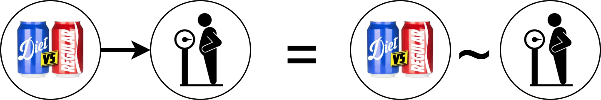
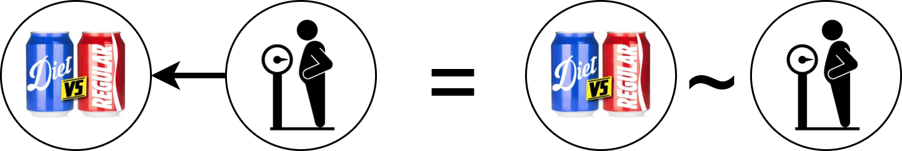

# Introduction

Every person on Earth thinks about causal questions all the time: *What will happen if I do this? Is this happening because of that? If I speed up, can I make it through the intersection before the light turns red?*

Scientists are no different. Whether we work in physics, psychology, climate science, or sociology, we are all interested in the forces and mechanisms that govern the part of the world we study—and what happens when we intervene in it.

A good example comes from nutrition science. Just think about the countless causal claims—some well-founded, others dubious—about how different foods affect the human body. Every day, people make dietary decisions based on these claims in order to maintain their health. At its core, the goal of nutrition science is to help us distinguish between true and false claims and provide evidence-based answers to questions about food and health. To do this, nutrition scientists rely heavily on experimental evidence.

But why? What makes experimental research designs so special? And why do research methods textbooks often emphasize that experimental evidence is essential—or even required—for making causal claims?

# A Real-World Example: Does Diet Soda Make You Gain Weight?

Let’s consider a ([hotly debated](https://www.youtube.com/watch?v=4fhBB6VRXXk)) causal claim:

> "Drinking diet soda will make you gain weight.”

How could we test whether this claim is true?

A simple approach would be to compare the body weights of people who prefer diet soda with those who prefer regular soda. This is an example of an observational (or correlational) study. We observe two naturally occurring variables—soda preference and body weight—and look for a correlation.

If people who prefer diet soda have higher body weight on average, some might conclude that diet soda causes weight gain. That logic seems reasonable: if diet soda causes weight gain, we might expect the two variables to be correlated (this is [rule 2](https://pedermisager.org/blog/eight_basic_rules_for_causal_inference/ "See "Rule 2: Causal influence creates correlation"") of causal inference).

However, a hard-nosed scientist would remain unconvinced. Why? Because [correlation does not imply causation](https://pedermisager.org/blog/why_does_correlation_not_equal_causation/). There are many reasons two variables might be correlated that have nothing to do with one causing the other.

# Two Common Problems with Correlational Studies

#### 1. **The Directionality Problem**

It could be that **body weight causes soda preference**, not the other way around. For instance, people who are already overweight might switch from regular to diet soda in an effort to manage their weight. This is called the directional problem; [rule 2](https://pedermisager.org/blog/eight_basic_rules_for_causal_inference/) works both ways:

#### 2. **The Third Variable Problem (Confounding)**

There might be a third variable that influences both soda preference and body weight. This is called **confounding** ([rule 3](https://pedermisager.org/blog/eight_basic_rules_for_causal_inference/ "See "Rule 3: Confounding creates correlation"")).

A clear example is **biological sex**:

-   Women might be more likely to choose diet soda due to targeted marketing.

-   Women also tend to weigh less than men.

So, diet soda drinkers might weigh less than regular soda drinkers on average—not because of the soda itself, but because more of them are women.

# Why Experiments Are Better for Causal Inference

To decide whether soda preference causes weight gain, scientists will often demand experimental evidence. Ideally, we want to see data from a randomized controlled experiment (also called randomized controlled trial [RCT], clinical trial, and true experiment). These experiments have two critical components that observational studies lack:

-   **Manipulation** – Researchers get to choose the value of the independent variable (in this case, soda type).

-   **Randomization** – The values of the independent variable are assigned randomly. Essentially, we flip a coin, and the result of the coin flip determines the value of the independent variable for each subject in the study.

To test our example claim, we could design a randomized experiment with participants assigned to two groups. One group drinks only diet soda for one year. The other group drinks only regular soda for a year. For each participant we flip a coin. If it lands head, the participant drinks diet soda for a year. If it lands tails they drink regular soda. At the end of the year we measure the body weights of everyone in both groups and see which group weighs the most on average.

Why is this setup a better test of the causal claim than an observational study? Because randomization has essentially killed the direction and third variables problems we had to worry about before. Think about it. If a coin flip decides whether a participant drinks diet or regular soda, then *nothing* causes soda preference in our experiment ([rule 4](https://pedermisager.org/blog/eight_basic_rules_for_causal_inference/ "See "Rule 4: Random manipulation protects a variable from causal influence"")).

This means we have no directional problem in a randomized experiment. If we see a correlation between soda preference (which group you are in) and body weight, it can’t be because body weight caused soda preference. *Nothing* causes soda preference in our experiment.

It also means we have no third variable problems in a randomized experiment. No variable can influence both soda preference and weight gain because no variable can influence soda preference. If we see a correlation between soda preference and body weight, it can’t be because a third variable is influencing both.

The only thing that can explain correlation between soda preference and body weight in a randomized experiment is that which type of soda you drink causes changes in body weight[^1].

[^1]: Technically, it could also be due to a type 1 error or selection bias. If we have collected data from enough people and make sure people from one group do not systematically drop out, we can rule this out.

Put more technically, experiment allows us to rule out more alternative causal hypotheses than an observational study when we observe a correlation between the independent and dependent variable. Type 1 error and selection bias remains a risk in both designs, but the likelihood is higher in an experiment that A\~B = A-\>B. The figure below demonstrates the difference in causal inference power between designs:

.](hypotheses_ruled_out_by_different_designs.png)

Protection from alternative interpretations is what makes experiments such powerful tools for causal inference. It is why evidence from randomized experiments are always desired—and sometimes required—to make claims in medical and health science. 

Experiments are not perfect divination tools. There are certainly cases where we may learn more from a well-designed observational study than a poorly designed experiment, and it is possible to draw causal conclusions without any experimental evidence. However, in general, if you’re looking for answers to a casual question you would be wise to look for experimental evidence. If none exist, be careful. Guessing causal mechanisms based observational evidence alone is usually very difficult.
