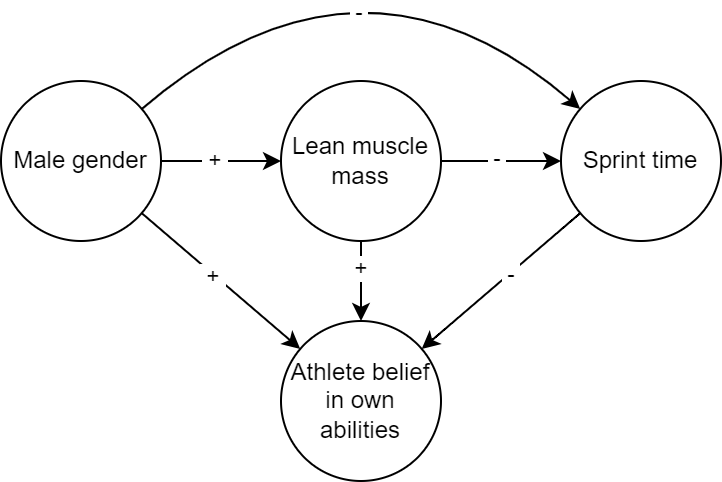
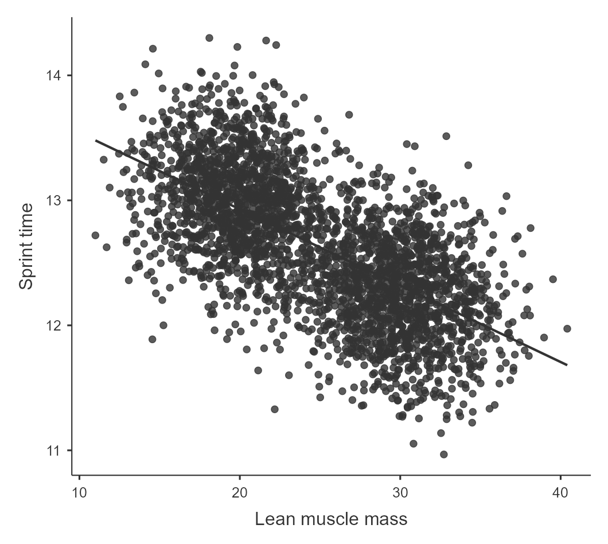
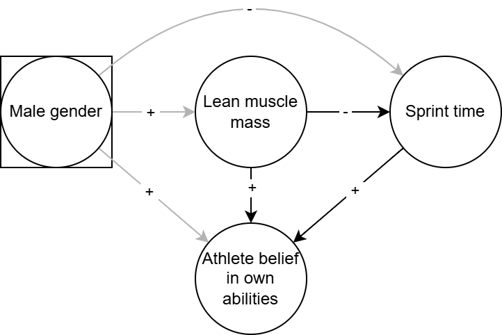
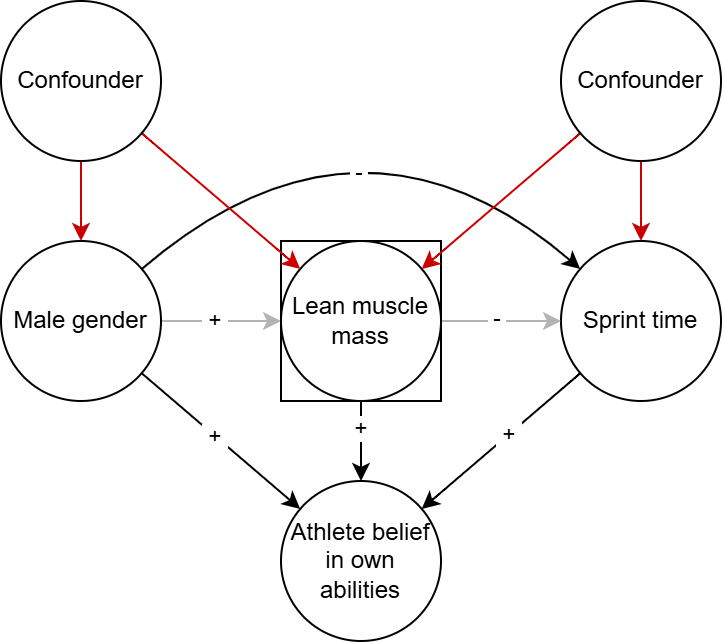

## NotebookLM video summary

I am experimenting with AI tools for augmenting my teaching resources. This is a NotebookLM summary of the blog post below. The visualizations provided are so-so, and I had to pad the video with custom visualizations in some places, but the overall summary is a quite good I think. Feedback most welcome!

<iframe width="720" height="405"
        src="https://www.youtube.com/embed/EYTNzfHmTvc"
        title="YouTube video player"
        frameborder="0"
        allow="accelerometer; autoplay; clipboard-write; encrypted-media; gyroscope; picture-in-picture; web-share"
        allowfullscreen>
</iframe>

## Introduction

In the previous blog posts in this series, we established why correlation is not causation and explored the core rules governing causal relationships (Isager, 2023, 2024a). We then looked at why Randomized Controlled Trials (RCTs) are the gold standard for answering causal questions: randomization essentially eliminates the influence of common causes, also called third variables or confounders (Isager, 2024b).

However, in the real world, randomization is often impossible, impractical, or unethical. We cannot ethically randomize people to smoke, nor can we practically randomize their height or their socioeconomic status.

Does this mean we must abandon causal inference whenever we only have observational data? Not at all. It is possible—though often difficult—to learn about causal direction from correlational data through the clever use of control variables. In this post, we will use a practical example to explore the power of statistical control, explaining why adjusting for the right variables clarifies relationships and why adjusting for the wrong ones can introduce new, serious biases.

The Jamovi analysis file used to produce all plots and statistics I report here is embedded at the end of this blog post and can be downloaded from <https://osf.io/6kf3w/files>. The OSF project also contains the R code to simulate the data and the raw CSV data file.

------------------------------------------------------------------------

## The Misleading Correlation of Muscle and Performance

Suppose you are a sports scientist studying how lean muscle mass affects athletic performance in track and field. You collect observational data across a large population of athletes, measuring their muscle mass and their performance times (e.g., 100m sprint time), as well as their gender and self-reported beliefs in their own athletic abilities (see accompanying Jamovi file: <https://osf.io/6kf3w/files/nukzx>). Suppose the following DAG governs the relationship between these variables:

When you plot the raw data, you find a strong correlation: athletes with greater lean muscle mass tend to have faster times, or better performance. Each kg of lean muscle mass gained seems to linearly reduce sprint finish time by 61 ms, *B =* -0.061 *CI 95%* [-0.064, -0.059]. A coach looking only at this overall correlation might conclude that increasing muscle mass directly causes a huge gain in performance.

However, a quick look at the plot reveals two distinct clusters of data points, likely corresponding to male and female athletes:

{width="900"}

We know that, generally, biological differences related to gender affect baseline muscle mass, and can also affect athletic performance through other mechanisms like bone structure, height, or sports-related gender norms. Thus, gender is a confounder for the causal effect we are interested in, as we can also see from the DAG (Male gender is a causal fork that points to both Lean muscle mass and Sprint time).

When we split the data and examine the relationship within each gender group—comparing male athletes only to other male athletes, and female athletes only to other female athletes—the strong association between lean muscle mass and sprint time is significantly reduced. Now, each kg of lean muscle mass only seems to give only 21 ms reduction in sprint time, *B =* -0.022, *95% CI* [-0.026, -0.017].

This much lower estimate is in fact our best estimate of the true causal effect. The original association was overestimating the true causal effect due to spurious positive negative correlation produced by the confounder “Gender” (when one causal arrow in the fork is negative and the other is positive, confounders produce negative correlation; when arrows are either both positive or both negative, confounders lead to positive correlation).

------------------------------------------------------------------------

## The Third-Variable Problem: Confounding

The core challenge in observational research is the "third variable problem," commonly known as **confounding bias**. A confounder is a third variable (Z) that causally influences both the exposure (X) and the outcome (Y). In a Directed Acyclic Graph (DAG), the confounder sits at a causal fork: $X \leftarrow Z \rightarrow Y$.

In our example, Gender (Z) influences Lean Muscle Mass (X) and also influences Athletic Performance (Y). This shared cause creates a spurious, non-causal association between muscle mass and performance. This phenomenon is formalized in Rule 3 of causal inference: **Confounding creates correlation**.

Because this correlation is created by the confounder, relying on the raw data leads to a biased estimate of the true effect of muscle mass on performance.

------------------------------------------------------------------------

## When Controlling Helps: Blocking Back-Door Paths

To estimate the true causal effect of muscle mass on performance from observational data, we must block the influence of the confounder. This is achieved by controlling for or conditioning on that variable. Controlling for gender means comparing athletes at the same level of gender (i.e., comparing women only to women, and men only to men).

Statistically, we can achieve this by including the confounder as a covariate in a regression model (example in accompanying Jamovi file), or by stratifying the analysis into subgroups. The goal is to compare units where the confounder (Z) can no longer explain the remaining association between X and Y. In our example, we control for Gender (the only confounder), the misleading association between Lean muscle mass and Sprint time disappears, allowing us to estimate the true causal relationship, if one exists:

In the language of DAGs, controlling for the confounder **“blocks” the back-door path** created by the common cause. When we successfully block all spurious paths (often called "back-door paths"), we achieve **d-separation** (*D-separation, n.d.*), meaning that the remaining correlation between X and Y reflects the true causal effect, provided our assumptions hold.

This successful adjustment is summarized by Rule 5: **Controlling for a confounder blocks correlation arising from that confounder**.

------------------------------------------------------------------------

## When Controlling Hurts: Colliders and Mediators

While controlling for confounders is essential, statistical control is a double-edged sword: controlling for the wrong variables can introduce bias where none existed. The "golden rule" is to **condition on common causes, not on common effects or intermediates**.

### The Danger of Colliders

A **collider** is structurally the opposite of a confounder. A collider (C) is a variable that is a common effect of two other variables ($X
\rightarrow C \leftarrow Y$). Typically, if two variables only share a common effect (a collider), they are uncorrelated in the general population.

Crucially, conditioning on a collider creates a spurious correlation between its causes. This is known as **collider bias** or **selection bias** (Rohrer, 2018). Rule 7 states: **Controlling for a collider leads to correlation** (Isager, 2024a).

For instance, suppose we are again estimating the effect of Lean muscle mass on Sprint time with our data. If not thinking about the DAG at all, it might sound reasonable to include “Belief in own athletic ability” as a control variable when estimating this effect. After all, belief in abilities seems “related” to both Lean muscle mass and Sprint time. Indeed, these variables are related according to the DAG. However, controlling for Belief is a terrible idea. If we add it to the regression model, we end up underestimating the true causal effect of muscle mass by about 50%, *B =* -0.01, *95% CI* [-0.015, -0.006]. This happens because controlling for Belief (C) opens up several previously closed backdoor paths between Lean muscle (X) mass and Sprint time (Y), which mixes spurious correlation back into the estimate. Conditioning on a collider can lead to both underestimation and overestimation of true effects, depending on the causal effects involved. 

The Trap of Mediators (Overcontrol Bias)

A mediator (M) is a variable that lies on the causal path from X to Y: $X \rightarrow M \rightarrow Y$. Mediators are part of the mechanism by which the cause affects the outcome.

When estimating the **total effect** of X on Y (the overall causal impact), we should not control for mediators. Controlling for a mediator blocks this causal pathway, removing the effect we are trying to measure. This is termed overcontrol bias (Elwert & Winship, 2014). Rule 6 confirms this: Controlling for a mediator blocks correlation arising from the mediated causal effect (Isager, 2024a).

In our example DAG,  Male gender (X) causes increased Lean muscle mass (M), which then causes reduced Sprint time (Y), controlling for Lean muscle masswould make it appear as though Gender had a much lower impact on performance than it really has. The true effect of Gender in this hypothetical scenario is 760 ms in favor of males, but if we control away gender differences in Lean muscle mass the effect of Gender is (wrongly) estimated to be 550 ms, *B =* -0.54, *95% CI* [-0.60, -0.49].

The exception is if you specifically want to estimate the **direct effect**—the effect of X on Y that *doesn't* go through M (such as sports-related gender norms causing men to have more access to coaching and financial support). The 550 ms estimate above represents the direct effect of Gender on Sprint time, not including muscle mass differences. This may sometimes be of interest. However, if you are not deliberately planning to estimate a direct effect, controlling for mediators is a bad idea.

If your goal is to estimate a direct effect, be careful: adjusting for a mediator can inadvertently create a new bias if there are uncontrolled common causes between the mediator and the outcome:

------------------------------------------------------------------------

## Practical Limits and Uncertainty

Statistical control is a powerful tool, but it can never perfectly replace the certainty offered by randomization. Our success hinges on critical, untestable assumptions:

### 1. Unmeasured Confounders

The most significant limitation is the risk of **unmeasured confounders**. You can only control for variables that you have actually measured. If an important common cause was omitted or measured inaccurately, residual confounding will persist, and your causal effect estimate will not be accurate:

### 2. Uncertainty in the Causal DAG

All of our advice relies on us correctly identifying the causal roles of our variables: is it a confounder, a collider, or a mediator? In reality, we are often uncertain about the true causal structure (the DAG).

If we mistakenly assume a variable is a confounder when it’s actually a collider, we introduce bias. Furthermore, in complex systems, a single variable can sometimes play multiple roles, simultaneously reducing one bias while increasing another (e.g., M-bias, as in the example above where Lean muscle mass is both a mediator and a collider). This highlights the need for careful, theory-driven DAG analysis before selecting control variables.

### 3. The Risk of Overadjustment

Resist the urge to throw every available variable into your model "just to be safe". Adjusting for irrelevant variables reduces statistical power, and, worse, if those extra variables happen to be colliders or mediators, you introduce new biases. More controls are not always better; only good controls (true confounders) help, while bad controls (colliders, mediators) mislead.

------------------------------------------------------------------------

## Conclusion

Controlling for third variables is an essential skill in causal inference when experiments are out of reach. We must condition on true confounders to block the spurious correlations they introduce. However, we must be vigilant about the variables we choose. **Controlling for the right variables clarifies the relationship, but controlling for the wrong variables distorts it**.

We rely on substantive domain knowledge and the visual logic of Directed Acyclic Graphs (DAGs) to make systematic decisions about which paths to close and which to leave open. Ultimately, while statistical adjustment for confounders can remove bias, it is conditional on the assumption that our underlying causal model is correct.

As Julia Rohrer (2017) summarized, “there’s no free lunch in causal inference”—statistical control cannot magically guarantee causality. It provides our best observational approximation of an experiment, but it requires careful thought, not blind calculation.

------------------------------------------------------------------------

## Further Reading

This blog posts presents the most basic concepts related to variable control for causal inference. For a more thorough introduction, I highly recommend the paper *A Crash Course in Good and Bad Controls* (Cinelli et al., 2024), which provides a much more comprehensive list of good and bad control scenarios while still staying relatively non-technical. Hernán & Robins' open-access textbook, *Causal Inference: What If* (Hernán & Robins, 2020) is an excellent textbook for people looking for a comprehensive and technical introduction. Finally, explore the writings of Julia Rohrer for accessible, example-driven explanations of how to navigate causal inference in social and behavioral science (e.g., Rohrer, 2018, 2024).

## Jamovi file with analyses

<iframe src="https://mfr.de-1.osf.io/render?url=https%3A%2F%2Fosf.io%2Fdownload%2Fnukzx%2F%3Fdirect%26mode%3Drender" width="100%" height="500px">

</iframe>

## References

Cinelli, C., Forney, A., & Pearl, J. (2024). A Crash Course in Good and Bad Controls. Sociological Methods & Research, 53(3), 1071–1104. <https://doi.org/10.1177/00491241221099552>

D-separation. (n.d.). Retrieved 13. november 2025, from <https://www.andrew.cmu.edu/user/scheines/tutor/d-sep.html>

Elwert, F., & Winship, C. (2014). Endogenous Selection Bias: The Problem of Conditioning on a Collider Variable. Annual review of sociology, 40, 31–53. <https://doi.org/10.1146/annurev-soc-071913-043455>

Hernán, M., & Robins, J. (2020). Causal Inference: What If. Chapman & Hall/CRC. <https://www.hsph.harvard.edu/miguel-hernan/causal-inference-book/>

Isager, P. M. (2023). Why does correlation not equal causation? Peder M. Isager. <https://pedermisager.org/blog/why_does_correlation_not_equal_causation/>

Isager, P. M. (2024a). Eight basic rules for causal inference. <https://pedermisager.org/blog/eight_basic_rules_for_causal_inference/>

Isager, P. M. (2024b). Why experiments are considered gold standard for answering causal questions. <https://pedermisager.org/blog/why-experiments-are-considered-gold-standard-for-answering-causal-questions/>

Rohrer, J. M. (2017, mars 14). That one weird third variable problem nobody ever mentions: Conditioning on a collider. The 100% CI. <https://www.the100.ci/2017/03/14/that-one-weird-third-variable-problem-nobody-ever-mentions-conditioning-on-a-collider/>

Rohrer, J. M. (2018). Thinking Clearly About Correlations and Causation: Graphical Causal Models for Observational Data. Advances in Methods and Practices in Psychological Science, 1(1), 27–42. <https://doi.org/10.1177/2515245917745629>

Rohrer, J. M. (2024). Causal inference for psychologists who think that causal inference is not for them. Social and Personality Psychology Compass, 18(3), e12948. <https://doi.org/10.1111/spc3.12948>
