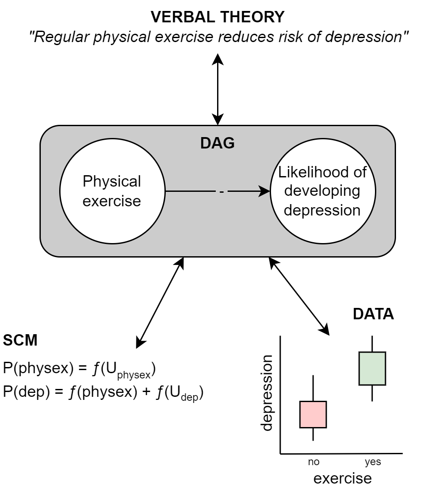
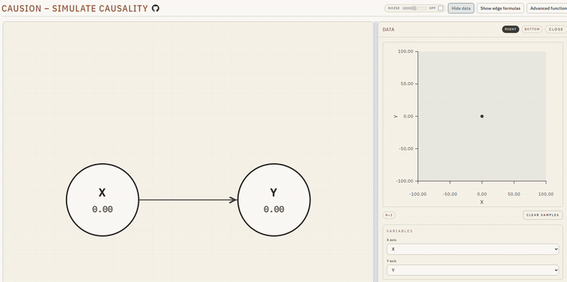

## Abstract

Causion is a free web app for building causal diagrams (DAGs) and then watching them behave.
You can assign values, add noise, generate a dataset, and switch from observation to intervention with the do() operator.
Try it now: <https://causion.pedermisager.org/>.

<iframe src="https://causion.pedermisager.org/" width="100%" height="700px" style="border:1px solid #ccc; border-radius:6px;">

</iframe>

## Background

In 2019 I took Miguel Hernán's course “[Causal Diagrams: Draw Your Assumptions Before Your Conclusions](https://www.edx.org/learn/data-analysis/harvard-university-causal-diagrams-draw-your-assumptions-before-your-conclusions)" and fell in love with causal inference—especially causal graph models. These deceptively simple pictures of circles and arrows are almost as easy to formulate as verbal statements about causes, and at the same time they convey a surprising amount of the information contained in a formal causal model. They can be read and appreciated by both mathematicians and applied researchers. In fact, they are a tool by which those two camps of scientists can talk with each other.

I have always felt that causal diagrams (directed acyclic graphs; DAGs) provide the missing link that lets us connect our verbal theories about causes to both formal computational models (structural causal models; SCMs) and statistical hypotheses about data.
If you can turn your verbal theory into a DAG, you are well on your way to being able to formalize your theory as a mathematical model.
You are also well on your way to generating severe tests of your causal theory, as causal diagrams can be used to generate statistical predictions about data.

However, it can be tricky to get a mental model of how causality “flows through” a DAG to generate observable data patterns.
This is difficult, I think, because to imagine a causal process we cannot think of static images.
We need to imagine a dynamic process unfolding over time.

When I think about how my causal theory is related to the data I expect to see in the world, I don't just think about the DAG itself.
I imagine the nodes (the little circles) in the DAG varying and changing their values, and then I imagine the influence of one changing variable flowing through the edges (the arrows) and into the other variables downstream in the model.
On the paper there is a static diagram, but in my head, a video is playing.
I could only really think deeply about causal questions once I learned how to imagine causal diagrams in this way.

## What Causion does

To help ourselves—and our students—develop that “video in your head” intuition, I created the web application Causion.
Causion lets you build DAGs and explore visually what happens when you manipulate variable values and assumptions.

-   Draw and edit DAGs quickly (add variables, connect them with arrows, rearrange the graph).
-   Assign and vary variables values easily.
-   See causal effects play out live: changes propagate through the graph with an animated “causal flow”.
-   Change functional forms and effect strengths in the underlying SCM.
-   Add noise or hidden/unmeasured influences to see how they distort what you observe.
-   Generate a dataset from the DAG and inspect how scatterplots change as you change the model.
-   Switch from observing to intervening using the do() operator (i.e., perform a randomized experiment inside the model).

## Who it is for (and what it is not)

I built Causion for a very practical reason: when I teach students about causal inference, I often want a live demo where students can predict what will happen and then immediately see whether they were right.
Causion lets me build a graph, tweak effect strengths and noise, generate data, and run do() interventions while watching the downstream consequences update in real time.

If you want formal diagram analysis (for example, identifying adjustment sets or checking graphical criteria), there are already excellent tools for that, like [DAGitty](https://www.dagitty.net/dags.html).

Causion is the companion tool for building intuition: “What pattern would this DAG produce?”
and “What changes when I intervene?”
it's less about getting the right answer from a graph, and more about developing the kind of mental model that makes graphs easier to reason with in the first place.

This blog is my first official "release" of the app.
I have tested it as well as I can, but I am confident there is still room for improvements.
If you try the app and something feels confusing (or if you find a bug), I'd genuinely love to hear about it.
Send me a comment here, on Github, or email me.

My hope is that Causion can help make causal ideas easier to teach, easier to learn, and easier to communicate.

## Links

Causion (web app): <https://causion.pedermisager.org/>

Source code: <https://github.com/pederisager/causion>

Tutorial video: <https://www.youtube.com/watch?v=C3fbtayWWOw>

<iframe width="100%" height="400" src="https://www.youtube.com/embed/C3fbtayWWOw" title="Causion tutorial video" frameborder="0" allow="accelerometer; autoplay; clipboard-write; encrypted-media; gyroscope; picture-in-picture" allowfullscreen>

</iframe>
